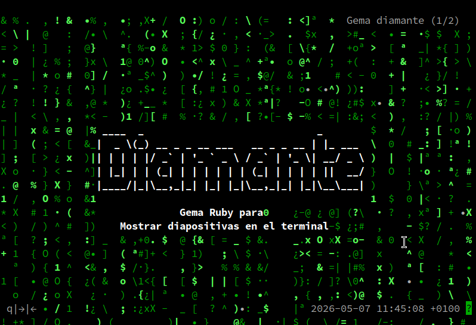

# Diamante

Presentar diapositivas en el terminal.

## Instalación

* Instalar Ruby.
* Instalar la gema `gem install diamante`

## Modo de uso

```bash
$ diamante PATH/TO/CONFIG.yaml
```

* Crear una carpeta con el fichero de configuración (YAML) y las diapositivas en ficheros de texto. [Ver ejemplo](./examples/1.demo/).

```bash
examples/1.demo
├── 01.txt
├── 02.txt
└── config.yaml
```
* Ejecutar `diamante show examples/1.demo/config.yaml`.



| Tecla | Función                       |
| ----- | ----------------------------- |
| q     | Salir de la presentación      |
| right | Ir a la siguiente diapositiva |
| left  | Ir a la diapositiva anterior  |

## Características

* El contenido de cada diapositiva va en un fichero de texto separado.
* El fichero de configuración tiene el siguiente formato:
```yaml
:game:
  :bye: "Morpheus: 'Follow me.'"  
:bg:
  :scene: Matrix
  :chars: "!#$%&\\\/()*+,-.01:;<=>?@[]^_oO{}|ª·¿•xX "
:fg:
  :scene: Slider
  :files: "examples/1.demo/*.txt"
:ui:
  :scene: UI
  :header: "Gema diamante"
```

Significado de los parámetros:

| Sección   | Parámetro   | Descripción          |
| --------- | ----------- | -------------------- |
| `:game`   | `:bye`      | Mensaje de despedida |
| `:bg`     | `:chars`    | Caracteres para el efecto Matrix |
| `:fg`     | `:files`    | Ficheros de texto con las diapositivas |
| `:ui`     | `:header`   | Título de la presentación |

## Desarrollo

* La biblioteca está hecha de forma modular para poder usar distintas escenas de background, foreground o user interface en el futuro.
* Actualmente no se están usando los parámetros `:scene`, pero en un futuro permitirán definir las escenas a cargar para reproducir la presentación.

## Contributing

Bug reports and pull requests are welcome on GitHub at https://github.com/dvarrui/diamante.

